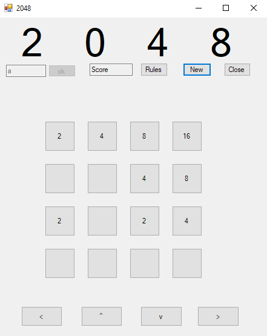

# 2048
a windows form version of the game 2048

I built this for a project given to us in my Component Based Software Design class. It is our (me and a partner's) take on the game called 2048.
The real verson can be played [here](https://play2048.co/)

This was probably the most difficult coding assignments I have ever completed. The algorithm for getting the tiles to move into their right spots was difficult.
There are still a couple of bugs that we were not able to completely fix, including spawning two new tiles on every move instead of one, and also
the game crashes when the board fills up. We were told to not worry about it too much by our professor since our game was slightly more advanced than our classmates.

A screenshot of the game can be seen here

